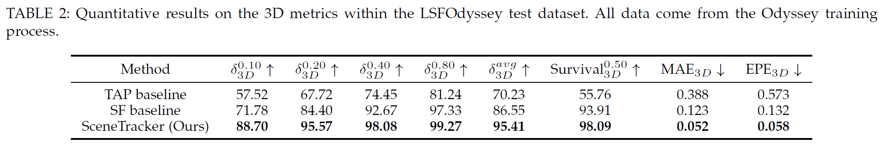
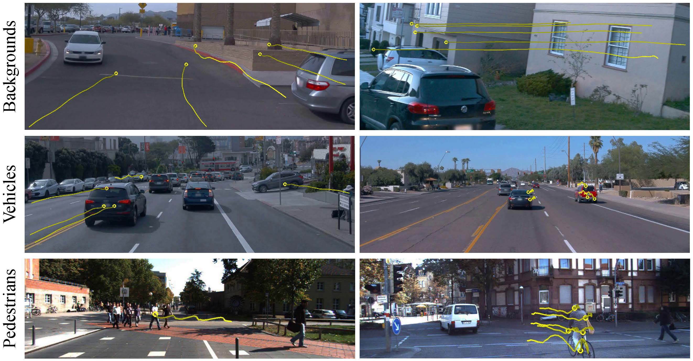

# SceneTracker: Long-term Scene Flow Estimation Network
This repository contains the source code for our paper:
- SceneTracker: Long-term Scene Flow Estimation Network | [Paper](https://arxiv.org/pdf/2403.19924.pdf)
  
  
  
  - [x] To better capture the fine-grained and long-term 3D motion, a comprehensive new task, long-term scene flow estimation (LSFE), is studied.
  - [x] A novel learning-based LSFE network, SceneTracker, is presented. SceneTracker shows superior capabilities in handling 3D spatial occlusion and depth noise interference.
  - [x] We build the first real-world evaluation dataset, LSFDriving, further substantiating SceneTracker's commendable generalization capacity. Specifically, the tracked points are sampled from static backgrounds, moving rigid vehicles, and moving non-rigid pedestrians' joints and garments.  

## Updates
- [April 29, 2024] 📣 The code of SceneTracker is coming soon!
- [April 28, 2024] 📣 The data of LSFOdyssey and LSFDriving is coming soon!
- [March 29, 2024] 📣 The paper of SceneTracker is made public!

## Environment
* NVIDIA 3090 GPU
* CUDA 11.1
* Python 3.8
* PyTorch 1.8.2

### Create a virtual environment and activate it.
```
conda create -n scenetracker python=3.8
conda activate scenetracker
```

### Dependencies
```
pip install torch==1.8.2 --extra-index-url https://download.pytorch.org/whl/lts/1.8/cu111
pip install einops==0.4.1
pip install cupy-cuda111
pip install pillow==9.5.0
pip install opencv-python==4.1.2.30
```

## Citing this Work

If you find our repository useful, please consider giving it a star ⭐ and citing our paper in your work:

```bibtex
@article{wang2024scenetracker,
  title={SceneTracker: Long-term Scene Flow Estimation Network},
  author={Wang, Bo and Li, Jian and Yu, Yang and Liu, Li and Sun, Zhenping and Hu, Dewen},
  journal={arXiv preprint arXiv:2403.19924},
  year={2024}
}
```
