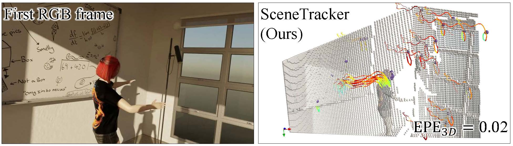

[//]: # (@File: README.md)

[//]: # (@Project: SceneTracker)

[//]: # (@Author : wangbo)

[//]: # (@Time : 2024.07.12)

# SceneTracker: Long-term Scene Flow Estimation Network
This repository contains the source code for our paper:
- SceneTracker: Long-term Scene Flow Estimation Network | [Paper](https://arxiv.org/pdf/2403.19924.pdf) | [中文介绍](https://mp.weixin.qq.com/s/XRo605YrAKbQPlQP2dELsg)
  
  - [x] To better capture the fine-grained and long-term 3D motion, a comprehensive new task, long-term scene flow estimation (LSFE), is studied.
  - [x] A novel learning-based LSFE network, SceneTracker, is presented. SceneTracker shows superior capabilities in handling 3D spatial occlusion and depth noise interference.
  - [x] We build the first real-world evaluation dataset, LSFDriving, further substantiating SceneTracker's commendable generalization capacity. Specifically, the tracked points are sampled from static backgrounds, moving rigid vehicles, and moving non-rigid pedestrians' joints and garments.  

## Updates
- [2024.07.12] 📣 A demo of SceneTracker is released!
- [2024.07.04] 📣 The code and trained weights of SceneTracker are released!
- [2024.05.30] 📣 The data of LSFOdyssey is released!
- [2024.04.28] 📣 The data of LSFDriving is coming soon!
- [2024.03.29] 📣 The paper of SceneTracker is made public!

## Environment

Our code has been successfully tested in the following environments:

* NVIDIA 3090 GPU
* CUDA 11.1
* Python 3.8
* PyTorch 1.8.2

```
conda create -n scenetracker python=3.8
conda activate scenetracker

pip install torch==1.8.2 --extra-index-url https://download.pytorch.org/whl/lts/1.8/cu111
pip install einops==0.4.1
pip install pillow==9.5.0
pip install opencv-python==4.9.0.80
pip install albumentations==1.3.1
pip install timm==0.9.12
```

## Trained Weights

Download the weights below and put them in the `exp/0-pretrain` path. 

| Model        | Training process | Weights                                                                                   | Comments                       |
|--------------|------------------|-------------------------------------------------------------------------------------------|--------------------------------|
| SceneTracker | Odyssey          | [scenetracker_odyssey_200k.pth](https://pan.baidu.com/s/1IanI-OFXDJ9JJYY_Yxsyzw&pwd=wang) | Best performance on LSFOdyssey |


## Demo

* Quick start.
  ```Shell
  bash script/demo.sh
  ```

## Datasets

To train / test SceneTracker, you will need to download the proposed datasets and update `data_root` in `data/dataset.py`.

* [LSFOdyssey](https://pan.baidu.com/s/1TP2b2TZ3tq5omnIZbUxa8w&pwd=u3xt)
* LSFDriving


[//]: # (**1. LSFOdyssey**)

[//]: # ()
[//]: # (The dataset is organized as follows:)

[//]: # ()
[//]: # (```text)

[//]: # (LSFOdyssey/)

[//]: # (├─ train/)

[//]: # (│  ├─ xxx/)

[//]: # (│  │  ├─ 000000/)

[//]: # (│  │  │  ├─ rgb.mp4)

[//]: # (│  │  │  ├─ deps.npz)

[//]: # (│  │  │  └─ track.npz)

[//]: # (│  │  ⁞)

[//]: # (│  │  └─ 00000x/)

[//]: # (│  ⁞)

[//]: # (│  └─ xxx/)

[//]: # (│)

[//]: # (└─ test/)

[//]: # (   ├─ xxx/)

[//]: # (   │  ├─ 000000/)

[//]: # (   │  │  ├─ rgb.mp4)

[//]: # (   │  │  ├─ deps.npz)

[//]: # (   │  │  ├─ track.npz)

[//]: # (   │  │  └─ intris.npz)

[//]: # (   │  ⁞)

[//]: # (   │  └─ 00000x/)

[//]: # (   ⁞)

[//]: # (   └─ xxx/)

[//]: # (```)

[//]: # ()
[//]: # (**2. LSFDriving**)

[//]: # ()
[//]: # (The dataset is organized as follows:)

[//]: # ()
[//]: # (```text)

[//]: # (_)

[//]: # (├─ LSFDriving/)

[//]: # (│  ├─ background/)

[//]: # (│  │  ├─ xxx/)

[//]: # (│  │  │  ├─ rgb.mp4)

[//]: # (│  │  │  ├─ track.npz)

[//]: # (│  │  │  └─ intris.npz)

[//]: # (│  │  ⁞)

[//]: # (│  │  └─ xxx/)

[//]: # (│  │)

[//]: # (│  ├─ vehicle/)

[//]: # (│  │)

[//]: # (│  └─ person/)

[//]: # (│)

[//]: # (└─ LSFDriving_Extra/)

[//]: # (   ├─ background_and_vehicle_nearest/)

[//]: # (   │  ├─ xxx/)

[//]: # (   │  │  └─ deps.npz)

[//]: # (   │  ⁞)

[//]: # (   │  └─ xxx/)

[//]: # (   │)

[//]: # (   └─ person/)

[//]: # (```)


## Training

* Train SceneTracker under the Odyssey training process.
  ```Shell
  bash script/train_odyssey.sh
  ```
  
## Testing

* Test SceneTracker on LSFOdyssey.
  ```Shell
  bash script/test_odyssey.sh
  ```

## Acknowledgments
We would like to thank [CoTracker](https://github.com/facebookresearch/co-tracker), [PointOdyssey](https://github.com/y-zheng18/point_odyssey) and [SplatFlow](https://github.com/wwsource/SplatFlow) for publicly releasing their code and data.

## Citing this Work

If you find our repository useful, please consider giving it a star ⭐ and citing our paper in your work:

```bibtex
@article{wang2024scenetracker,
  title={SceneTracker: Long-term Scene Flow Estimation Network},
  author={Wang, Bo and Li, Jian and Yu, Yang and Liu, Li and Sun, Zhenping and Hu, Dewen},
  journal={arXiv preprint arXiv:2403.19924},
  year={2024}
}
```
